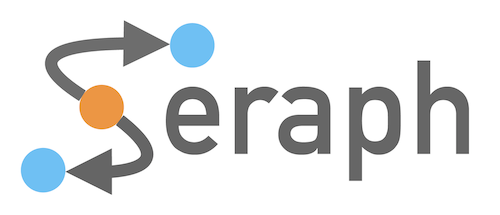

# Seraph: Continuous Queries on Property Graph Streams
[](https://opensource.org/licenses/Apache-2.0)

> This proof-of-concept implementation is currently under development.

Seraph is a query language that extends Cypher with stream semantics to register continuous queries on 
property graph streams. In this proof-of-concept implementation we are using Neo4j and RSP4J as a base.

RSP4J is a library to build RDF Stream Processing (RSP) Engines according to the reference model
RSP-QL [1](http://jeanpi.org/wp/media/rspql_ijswis_dellaglio_2015.pdf).

## Example Seraph Query

```sql
REGISTER QUERY student_trick STARTING AT 2022-10-14T14:45 {
  MATCH (:Bike)-[r:rentedAt]->(s:Station),
      q = (b)-[:returnedAt|rentedAt*3..]-(o:Station) 
  WITHIN PT1H 
  WITH r, s, q, relationships(q) as edges, 
    [n IN nodes(q) WHERE 'Station' IN labels(n) | n.id] as hopStations 
  WHERE ALL(e IN edges WHERE 
    e.user_id = r.user_id AND e.val_time > r.val_time AND 
    (e.duration IS NULL OR e.duration < 20) ) 
  EMIT r.user_id, s.id, r.val_time, hopStations 
  ON ENTERING 
  EVERY PT5M 
}
```

## License
    Copyright 2023 Lyon 1 University & University of Leipzig
    
    Licensed under the Apache License, Version 2.0 (the "License");
    you may not use this file except in compliance with the License.
    You may obtain a copy of the License at
    
      http://www.apache.org/licenses/LICENSE-2.0
    
    Unless required by applicable law or agreed to in writing, software
    distributed under the License is distributed on an "AS IS" BASIS,
    WITHOUT WARRANTIES OR CONDITIONS OF ANY KIND, either express or implied.
    See the License for the specific language governing permissions and
    limitations under the License.